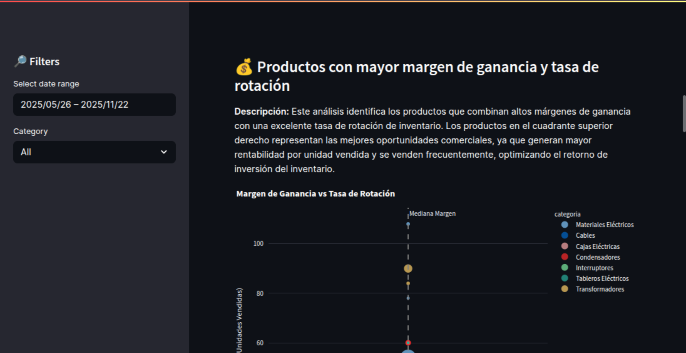
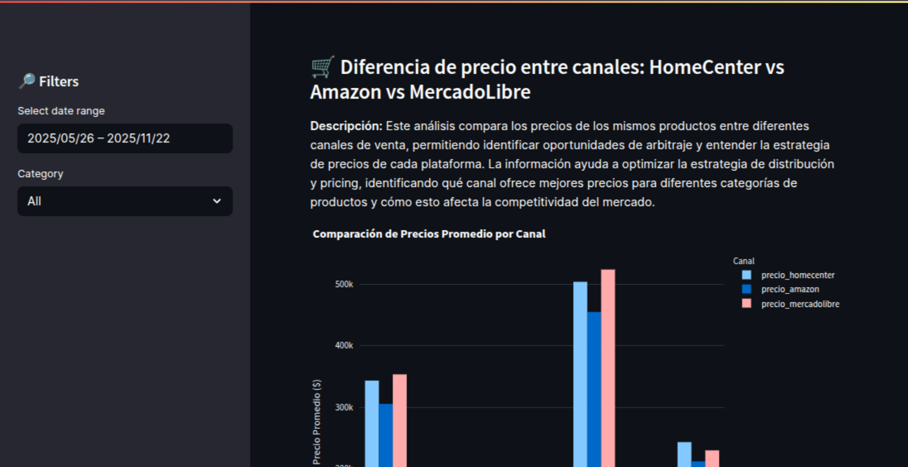

# 📊 Sales Intelligence Dashboard

Un dashboard interactivo y moderno para análisis de inteligencia de ventas, desarrollado con Streamlit y Python. Este proyecto proporciona insights profundos sobre el rendimiento de productos, satisfacción del cliente y análisis competitivo de precios entre diferentes canales de venta.

## 🚀 Características Principales

### 📦 Lista de Productos

- **Top 15 productos más vendidos** por unidades vendidas
- Gráfico de barras horizontal con categorización por color
- Tabla detallada con métricas de revenue y precios promedio
- Filtros dinámicos por fecha y categoría


### 💰 Análisis de Margen y Rotación

- **Scatter plot interactivo** de margen de ganancia vs tasa de rotación
- Identificación de productos con mejor ROI
- Líneas de referencia para medianas
- Top 10 productos por margen y rotación
- Tamaño de burbujas basado en revenue total



### 😊 Satisfacción del Cliente

- **Análisis de satisfacción** por categoría de producto (escala 1-5)
- Gráfico de barras con escala de colores
- Distribución de puntajes en gráfico circular
- Ranking de categorías por satisfacción promedio
- Métricas de ventas y revenue por categoría


### 🛒 Análisis Competitivo de Precios

- **Comparación de precios** entre HomeCenter, Amazon y MercadoLibre
- Gráfico de barras agrupadas por canal
- Diferencias porcentuales vs HomeCenter
- Identificación de oportunidades de arbitraje
- Análisis por categoría de producto



## 🛠️ Tecnologías Utilizadas

- **Streamlit** - Framework para aplicaciones web interactivas
- **Pandas** - Manipulación y análisis de datos
- **Plotly** - Visualizaciones interactivas y modernas
- **Python 3.8+** - Lenguaje de programación base

## 📋 Requisitos Previos

- Python 3.8 o superior
- pip (gestor de paquetes de Python)

## 🔧 Instalación

1. **Clona el repositorio:**

```bash
git clone https://github.com/tu-usuario/sales-intelligence-dashboard.git
cd sales-intelligence-dashboard
```

2. **Instala las dependencias:**

```bash
pip install -r requirements.txt
```

3. **Ejecuta el dashboard:**

```bash
streamlit run app.py
```

4. **Abre tu navegador** en `http://localhost:8501`

## 📁 Estructura del Proyecto

```
sales-intelligence-dashboard/
├── app.py                 # Aplicación principal de Streamlit
├── data_aug.csv          # Dataset de ventas (generado por data_convert.py)
├── data_convert.py       # Script para generar datos de ejemplo
├── requirements.txt      # Dependencias del proyecto
├── README.md            # Este archivo
└── .gitignore           # Archivos a ignorar en Git
```

## 📊 Estructura de Datos

El dashboard utiliza un dataset con las siguientes columnas principales:

- `fecha_venta` - Fecha de la venta
- `producto` - Nombre del producto
- `categoria` - Categoría del producto
- `precio` - Precio de venta
- `unidades_vendidas` - Cantidad vendida
- `fuente_trafico` - Canal de tráfico
- `satisfaccion_cliente` - Puntaje de satisfacción (1-5)
- `precio_homecenter` - Precio en HomeCenter
- `precio_amazon` - Precio en Amazon
- `precio_mercadolibre` - Precio en MercadoLibre

## 🎯 Funcionalidades del Dashboard

### Filtros Interactivos

- **Rango de fechas** - Selecciona el período de análisis
- **Categoría** - Filtra por categoría específica de productos
- **Actualización en tiempo real** de todas las métricas y gráficos

### Métricas Principales

- **Total Revenue** - Ingresos totales del período
- **Units Sold** - Unidades vendidas
- **Average Ticket** - Ticket promedio
- **Unique Products** - Productos únicos vendidos

### Visualizaciones Interactivas

- Gráficos responsivos que se adaptan al tamaño de pantalla
- Tooltips informativos con detalles adicionales
- Zoom y pan en gráficos de dispersión
- Exportación de datos en formato tabla

## 🔄 Generación de Datos

Para generar nuevos datos de ejemplo, ejecuta:

```bash
python data_convert.py
```

Este script creará un archivo `data_aug.csv` con datos simulados que incluyen:

- Información de ventas realista
- Puntajes de satisfacción del cliente
- Precios de diferentes canales de venta
- Métricas de margen de ganancia

## 📈 Casos de Uso

### Para Analistas de Negocio

- Identificar productos de alto rendimiento
- Analizar tendencias de satisfacción del cliente
- Optimizar estrategias de pricing

### Para Equipos de Marketing

- Entender qué productos generan mayor satisfacción
- Analizar la competencia de precios
- Identificar oportunidades de mercado

### Para Gestión de Inventario

- Optimizar la rotación de productos
- Identificar productos con mejor margen
- Planificar compras basadas en rendimiento

---

⭐ **¡No olvides darle una estrella al repositorio si te resulta útil!**
